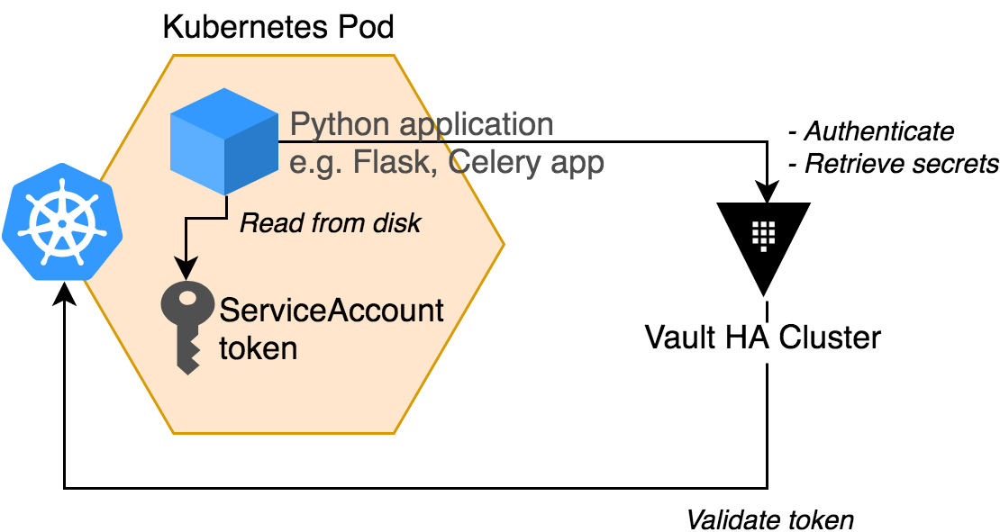
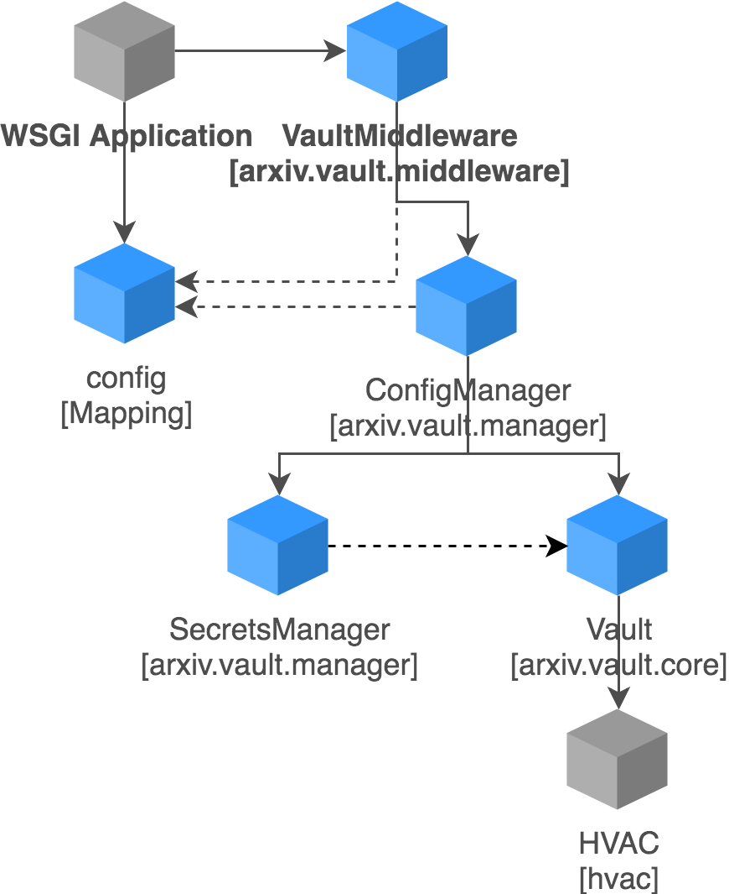

Architectural overview
======================

Background
----------
`HashiCorp Vault <https://www.vaultproject.io/>`_ provides a secure
clearinghouse for sensitive information required by our applications, including
engines for creating, managing, and revoking short-lived credentials for AWS
resources, databases, and other protected systems. Using Vault increases our
overall security profile by eliminating the need to embed secrets in
application configurations, and makes it much easier to implement short
lifetimes and rotation without a ton of manual human intervention.

Applications need to be able to obtain sensitive information from Vault
via its API. Handling this outside of the application is a bit janky; either a
sidecar process is required, or the app must be periodically killed and
restarted with fresh secrets (e.g. database credentials).

The goal of this project is to reduce the complexity of using Vault secrets by
implementing a lightweight Python integration that runs inside the client app.

We should be able to use the following information...

- Auth token
- Vault endpoint and port number
- The name of the Vault role that the application requires

...to retrieve the followings kinds of secrets:

- AWS credentials bound to a specific policy in Vault
- Database credentials provisioned by Vault
- Generic secrets (key/value)

Requirements
------------

- Configured and deployed as part of the application itself; no additional
  containers to run, daemonization, etc.
- Can be used in any Python application that we currently or plan to operate,
  including with Flask, Celery, and Kinesis consumers.
- Retrieves secrets and holds on to them for use during runtime so that we
  don't need to retrieve them every time we need them.
- Monitors the lease duration/expiration of each secret, and automatically
  refreshes the credential(s) as needed.
- Supports validation of self-signed Vault certificate.

Supports the following engines/types:

- Key/value v2
- AWS
- Database

Other nice things that we want:

- Provides a WSGI middleware for use in WSGI apps
- Can generate database URIs from secrets that are ready to use

Future:

- Consider PKI secrets, e.g. if we need to use client certs, or need to
  validate self-signed certs.

Solution strategy
-----------------
Vault is configured with the `Kubernetes auth method
<https://www.vaultproject.io/docs/auth/kubernetes.html>`_. Applications running
in Kubernetes can authenticate with Vault using a Kubernetes ServiceAccount
token. Each deployment in Kubernetes must therefore have a ServiceAccount in
the namespace in which it is deployed, and Vault must be configured with a
role that maps to that ServiceAccount. The application can load the token from
disk within its pod. Vault then uses the Kubernetes API to validate the token,
and returns and authentication token to the application for use in subsequent
requests.

The application may use the Vault authentication token to retrieve secrets
within the constraints of its role/bound policies.

Each application must therefore be configured with:

- ``KUBE_TOKEN``, the path to the ServiceAccount token on disk;
- ``VAULT_ROLE``, the role in Vault that is bound to the ServiceAccount in the
  application's namespace.
- ``VAULT_HOST``, the hostname of the Vault API;
- ``VAULT_PORT``, the port of the Vault API;
- ``VAULT_SCHEME``, defaults to ``https``;
- ``VAULT_REQUESTS``, which details the secrets that should be retrieved
  from Vault. See :class:`arxiv.vault.manager.SecretsManager` for details.

Components
----------
:class:`arxiv.vault.core.Vault` is the domain-specific client implementation
for interactive with Vault. It uses `hvac
<https://hvac.readthedocs.io/en/stable/overview.html#>`_, along with an
extension for the MySQL secrets engine
(:class:`arxiv.vault.hvac_extensions.api.secrets_engines.mysql`).

:class:`arxiv.vault.manager.SecretsManager` is responsible for fulfilling
:class:`.SecretRequest`\s using a :class:`.Vault` instance.

:class:`arxiv.vault.manager.ConfigManager` will load :class:`.SecretRequest`\s
from an application config (e.g. a Flask config), and orchestrate a
:class:`.SecretsManager` and :class:`.Vault` to keep the config up to date.

For WSGI apps, :class:`arxiv.vault.middleware.VaultMiddleware` will use
:class:`.ConfigManager` to obtain and manage secrets, and update them before
handling a request if they are expired. It is designed with the pattern
in :mod:`arxiv.base.middleware` in mind, but does not need to be used that way.
